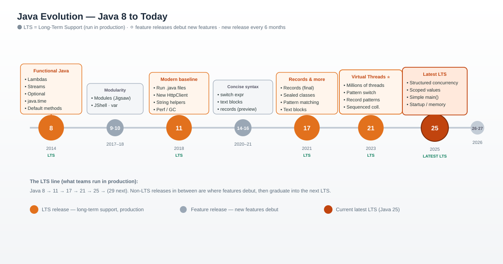
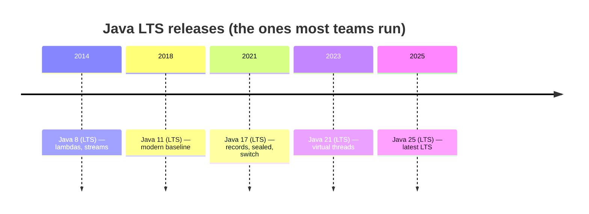
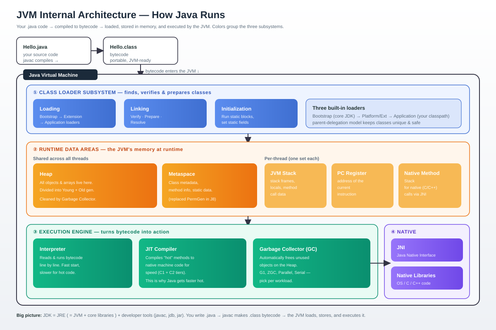
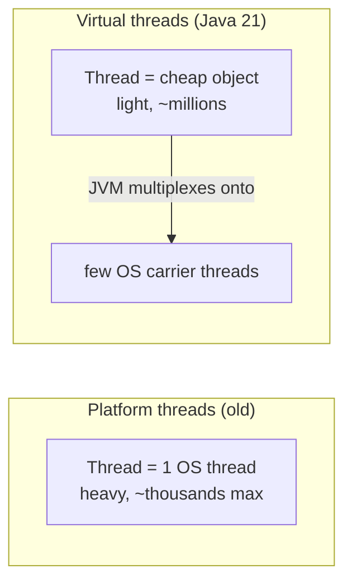

# Java, Version by Version — From Java 8 to Today

> **In one sentence:** Since Java 9, a new Java version ships **every 6 months**, with a **Long-Term Support (LTS)** release every few years — this guide walks through what actually changed in each one, in plain language, from Java 8 up to the latest.

Whether you're on an old Java 8 codebase or starting fresh on the newest release, this page shows you *what's new, why it matters,* and *what to reach for today.*



---

## How Java releases work (read this first)

Before Java 9, big releases came every few years. Since then, Java switched to a **predictable train**:

- **A new feature release every 6 months** — March and September.
- **An LTS (Long-Term Support) release** roughly every 2 years — this is the one companies run in production and get years of updates for.
- **Preview features** let you try new language features early (behind a flag) before they're finalized.



**The LTS line to remember:** Java **8 → 11 → 17 → 21 → 25** (next LTS is 29). Non-LTS releases (9, 10, 12–16, 18–20, 22–24, 26, 27…) are where features *debut*, then roll up into the next LTS.

| Version | Year | LTS? | One-line headline |
|---------|------|------|-------------------|
| **8** | 2014 | ✅ | Lambdas + Streams — Java goes functional |
| **9** | 2017 | — | Module system (Jigsaw), JShell |
| **10** | 2018 | — | `var` local variable type inference |
| **11** | 2018 | ✅ | Modern baseline; run `.java` files directly |
| **14–15** | 2020 | — | Records, `switch` expressions, text blocks (preview→final) |
| **17** | 2021 | ✅ | Records, sealed classes, pattern matching mature |
| **21** | 2023 | ✅ | **Virtual threads** — massive concurrency made easy |
| **25** | 2025 | ✅ | Latest LTS — structured concurrency, performance |

---

## How the JVM works internally

Before the version-by-version tour, here's the engine underneath it all. When you run Java, your `.java` file is compiled by `javac` into **bytecode** (`.class`), and the **JVM (Java Virtual Machine)** loads, stores, and executes that bytecode. "Write once, run anywhere" works because the *same* bytecode runs on any JVM.



The JVM has three main subsystems (color-coded in the diagram):

### ① Class Loader subsystem
Finds your classes and gets them ready, in three phases:
- **Loading** — reads the `.class` bytecode. Three loaders work in a parent-delegation chain: **Bootstrap** (core JDK) → **Platform/Extension** → **Application** (your classpath).
- **Linking** — **verify** (is the bytecode safe/valid?), **prepare** (allocate static fields), **resolve** (link references).
- **Initialization** — runs static initializers and sets static values.

### ② Runtime Data Areas (JVM memory)
Where everything lives while your program runs:

| Area | Shared? | Holds |
|------|---------|-------|
| **Heap** | shared by all threads | All **objects** and arrays; split into Young + Old generations; cleaned by the GC |
| **Metaspace** | shared | Class metadata & method info (replaced "PermGen" in Java 8) |
| **JVM Stack** | one per thread | Method call frames, local variables |
| **PC Register** | one per thread | Address of the currently executing instruction |
| **Native Method Stack** | one per thread | State for native (C/C++) calls |

Most memory issues you'll hear about — `OutOfMemoryError`, GC tuning — are about the **Heap**.

### ③ Execution Engine
Turns bytecode into real work:
- **Interpreter** — runs bytecode instruction by instruction. Starts fast, but slower for code that runs a lot.
- **JIT (Just-In-Time) Compiler** — spots "hot" methods and compiles them to **native machine code** (tiers C1 → C2). This is why a Java app *speeds up* after warming up.
- **Garbage Collector (GC)** — automatically frees objects on the Heap you no longer use, so you don't manage memory by hand. Pick a collector per workload: **G1** (default), **ZGC** (low pause), **Parallel** (throughput), **Serial** (small apps).

### ④ Native interface
- **JNI (Java Native Interface)** + **Native Libraries** let Java call into OS-level C/C++ code when needed.

> **JDK vs JRE vs JVM:** the **JVM** runs bytecode; the **JRE** = JVM + core libraries (enough to *run* Java); the **JDK** = JRE + developer tools like `javac` and `jar` (enough to *build* Java). You install the JDK to develop.

---

## Java 8 (2014) — the release that changed everything

Java 8 is still the most important release to understand, because it introduced **functional programming** to Java. Even modern code builds on these ideas.

### Lambdas — functions as values

Before, you needed a whole anonymous class to pass behavior around. Lambdas make it one line:

```java
// Before Java 8
Runnable r = new Runnable() {
    public void run() { System.out.println("Hi"); }
};

// Java 8 — a lambda
Runnable r = () -> System.out.println("Hi");
```

### Streams — process collections like a pipeline

Streams let you filter, map, and reduce data declaratively instead of with manual loops:

```java
List<String> names = List.of("Ann", "Bob", "Charlie", "Dan");

// "Give me the uppercase names longer than 3 letters"
List<String> result = names.stream()
    .filter(n -> n.length() > 3)
    .map(String::toUpperCase)
    .collect(Collectors.toList());   // [CHARLIE]
```

### Other Java 8 highlights

- **`Optional<T>`** — a container that may or may not hold a value, to fight `NullPointerException`.
- **New Date/Time API** (`java.time`) — `LocalDate`, `LocalDateTime`, `Duration` — finally a sane, immutable date library.
- **Default methods** — interfaces can have method bodies, so APIs can evolve without breaking implementers.

> **Why it still matters:** lambdas + streams + `Optional` + `java.time` are everyday tools. If you learn one older release deeply, make it Java 8.

---

## Java 9–10 (2017–2018) — modularity and `var`

### Java 9 — the Module System (Project Jigsaw)

Java 9 split the JDK itself into **modules** and let you declare your app as modules too, with explicit dependencies:

```java
// module-info.java
module com.myapp {
    requires java.sql;          // what I depend on
    exports com.myapp.api;      // what I let others use
}
```

Also in 9: **JShell** (an interactive Java REPL for experimenting), and handy factory methods like `List.of(...)`, `Map.of(...)`.

### Java 10 — `var` for local variables

Let the compiler infer the type of local variables — less boilerplate, same type safety:

```java
var names = new ArrayList<String>();   // compiler knows it's ArrayList<String>
var count = 42;                        // int
```

`var` only works for local variables where the type is obvious from the right-hand side — it's **not** dynamic typing.

---

## Java 11 (2018, LTS) — the modern baseline

Java 11 became the default "modern Java" version for years. Highlights:

- **Run a single `.java` file directly** — `java Hello.java`, no separate compile step. Great for scripts and learning.
- **New `HttpClient`** — a modern, built-in HTTP/2 client (no more third-party libraries for simple calls).
- **Handy String methods** — `strip()`, `isBlank()`, `lines()`, `repeat(n)`.
- **`var` in lambda parameters**, and lots of performance/GC improvements.

```java
// New HttpClient (Java 11)
HttpClient client = HttpClient.newHttpClient();
HttpRequest request = HttpRequest.newBuilder()
    .uri(URI.create("https://example.com"))
    .build();
HttpResponse<String> res = client.send(request, BodyHandlers.ofString());
System.out.println(res.body());
```

> **If you're stuck on Java 8**, Java 11 is the most common first upgrade target: it's LTS, stable, and unlocks modern tooling.

---

## Java 14–16 (2020–2021) — the modern language features arrive

These non-LTS releases introduced the features that make modern Java feel concise. Most were "preview" here and finalized by Java 17.

### `switch` expressions — switch that returns a value

```java
// Old switch: verbose, fall-through bugs
// New switch expression (arrow form, no break needed):
String day = switch (dayOfWeek) {
    case MON, TUE, WED, THU, FRI -> "Weekday";
    case SAT, SUN -> "Weekend";
};
```

### Text blocks — multi-line strings without escaping

```java
String json = """
    {
      "name": "Ann",
      "role": "engineer"
    }
    """;
```

### Records — data classes in one line

A `record` auto-generates the constructor, getters, `equals()`, `hashCode()`, and `toString()`:

```java
// One line replaces ~50 lines of boilerplate
public record Point(int x, int y) {}

var p = new Point(3, 4);
p.x();            // 3
p.toString();     // Point[x=3, y=4]
```

### Pattern matching for `instanceof`

```java
// Before
if (obj instanceof String) {
    String s = (String) obj;   // manual cast
    ...
}
// After — bind in one step
if (obj instanceof String s) {
    System.out.println(s.length());
}
```

---

## Java 17 (2021, LTS) — the "new default" for years

Java 17 is where the modern features above became **final and production-ready**, making it the LTS most teams jumped to after 8/11.

### Sealed classes — control who can extend you

Restrict a type's subclasses to a known, closed set — perfect with pattern matching:

```java
public sealed interface Shape permits Circle, Square, Triangle {}
public record Circle(double radius) implements Shape {}
public record Square(double side) implements Shape {}
public record Triangle(double base, double height) implements Shape {}
```

### Records + sealed + switch = elegant modeling

```java
double area = switch (shape) {
    case Circle c   -> Math.PI * c.radius() * c.radius();
    case Square s   -> s.side() * s.side();
    case Triangle t -> 0.5 * t.base() * t.height();
};
```

> **Java 17 in one line:** records + sealed types + pattern-matched switch + text blocks make everyday code dramatically shorter and safer.

---

## Java 21 (2023, LTS) — the big leap: Virtual Threads

Java 21 is arguably the most impactful LTS since 8, thanks to **virtual threads** (Project Loom).

### Virtual threads — millions of cheap threads

Traditional threads are heavy (each maps to an OS thread), so you needed thread pools and complex async code to scale. **Virtual threads** are lightweight — you can have *millions* — so you can write simple, blocking-style code that still scales massively.

```java
// Handle 10,000 tasks, each on its own virtual thread — no pool tuning
try (var executor = Executors.newVirtualThreadPerTaskExecutor()) {
    for (int i = 0; i < 10_000; i++) {
        executor.submit(() -> {
            // "blocking" code here is fine — the JVM parks the virtual thread
            return fetchFromDatabase();
        });
    }
}
```



### More Java 21 highlights

- **Pattern matching for `switch`** — finalized, including record deconstruction: `case Point(int x, int y) ->`.
- **Sequenced collections** — a common API for ordered collections (`getFirst()`, `getLast()`).
- **Record patterns** — destructure records directly in `switch`/`instanceof`.

> **Why it matters:** virtual threads let ordinary web apps handle huge concurrency with simple code — often removing the need for reactive/async frameworks.

---

## Java 25 (2025, LTS) — the latest LTS

Java 25 is the newest Long-Term Support release. It refines the Java 21 direction and adds performance and developer-experience wins. Notable areas:

- **Structured concurrency** — treat a group of related concurrent tasks as one unit, so they start, finish, and fail together (much easier error handling and cancellation).
- **Scoped values** — a safer, cheaper alternative to `ThreadLocal` for sharing immutable data within a task, designed for the virtual-thread world.
- **Simpler "beginner" `main`** — you can write a runnable program without the full `public static void main(String[])` ceremony, lowering the on-ramp for newcomers.
- **Performance & startup** — ongoing work like compact object headers and ahead-of-time profiling to improve memory use and startup time.

> **What to run today:** for a new production system, **Java 25 (LTS)** is the current recommended baseline; **Java 21 (LTS)** remains an excellent, widely-adopted choice.

---

## Java 26 & 27 (2026) — what's next

The 6-month train keeps rolling. **Java 26** (March 2026) and **Java 27** (September 2026) are the latest feature releases, continuing to polish the language, improve performance, and add capabilities around concurrency, and integration with modern workloads like AI and cryptography. These are non-LTS "feature preview" releases — great for trying what's coming, while **Java 25** stays the LTS for production until the next LTS (Java 29).

*Feature details for the newest releases evolve; confirm specifics against the official release notes below.*

---

## Quick decision guide

| Your situation | Recommended version |
|----------------|---------------------|
| New production project (2026) | **Java 25 (LTS)** — or Java 21 if your ecosystem hasn't caught up |
| Large existing app, conservative | **Java 21 (LTS)** — huge ecosystem support, virtual threads |
| Stuck on Java 8, want a safe step | **Java 11 (LTS)** first, then 17/21 |
| Trying the newest features | **Java 26 / 27** (non-LTS), behind preview flags where needed |

### Migration tips (moving off Java 8)

1. **Upgrade in LTS hops:** 8 → 11 → 17 → 21 → 25, testing at each stop.
2. **Watch removed APIs:** older internal APIs, some `sun.*` classes, and applets are gone; the module system (Java 9+) enforces boundaries.
3. **Update build tools & dependencies first** (Maven/Gradle, plugins, libraries) — most upgrade pain is outdated dependencies, not your code.
4. **Turn on new features gradually:** adopt records, `switch` expressions, and virtual threads where they simplify existing code.

---

## The one-slide summary

- **Java 8** — lambdas, streams, `Optional`, `java.time`. The functional foundation.
- **Java 9–11** — modules, `var`, modern `HttpClient`; Java 11 = first modern LTS.
- **Java 17** — records, sealed classes, pattern matching, text blocks. Concise + safe.
- **Java 21** — virtual threads. Massive concurrency, simple code.
- **Java 25** — latest LTS: structured concurrency, scoped values, performance.
- **New every 6 months; LTS every ~2 years (8 → 11 → 17 → 21 → 25 → 29).**

---

## Resources

- [Java version history — Wikipedia](https://en.wikipedia.org/wiki/Java_version_history) *(overview; details rephrased for compliance)*
- [Oracle Java SE downloads & LTS](https://www.oracle.com/java/technologies/downloads/)
- [Oracle Java SE support roadmap](https://www.oracle.com/java/technologies/java-se-support-roadmap.html)
- [OpenJDK](https://openjdk.org/)

*This is an educational overview. Exact feature status (preview vs final) and the newest release details change over time — check the official release notes before relying on specifics in production.*
